# Анализ земель сельскохозяйственного назначения Озинского района

Курсовая работа по дисциплине «Разработка геоинформационных систем
для предприятий АПК».

## Задача

Требуется провести комплексный анализ земель сельскохозяйственного
назначения Озинского района Саратовской области с использованием
геоинформационных систем, данных дистанционного зондирования Земли
и методов пространственного анализа. Исследование охватывает три
направления: анализ структуры посевных площадей и землепользователей
по данным ЕФИС ЗСН, оценка рельефа территории для выявления
эрозионных рисков, расчёт спектральных индексов растительности
и влажности для оценки состояния сельскохозяйственных угодий.

## Исходные данные

Основные сведения о земельных участках получены из Единой
федеральной информационной системы земель сельскохозяйственного
назначения. Система содержит данные о кадастровых номерах, площади,
правовом статусе, владельцах и фактически возделываемых культурах.
Атрибутивная таблица включает около двух десятков полей, в том числе
код фактически посеянной культуры, тип землепользования, форму
собственности и объём собранного урожая.

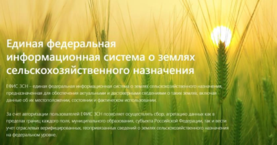

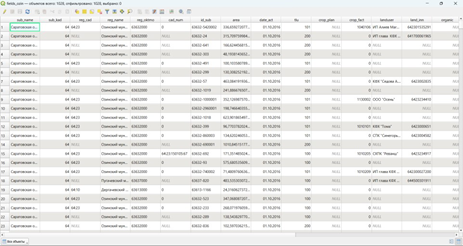

Данные дистанционного зондирования получены через платформу
Earth Explorer. Для расчёта спектральных индексов использованы
снимки Landsat 8 Collection 2 Level 2 за июнь 2017 года, отобранные
по критерию минимальной облачности. Для анализа рельефа применены
данные SRTM.

## Методология

Анализ проводился в геоинформационной системе QGIS. Работа включала
несколько этапов.

На первом этапе исходные данные ЕФИС ЗСН были дополнены справочником
культур по артикулам и визуализированы в разрезе культур и владельцев
земельных участков. Отдельное внимание уделено пустым значениям
в атрибутивных таблицах, которые могут указывать на неполноту
исходной информации.

На втором этапе проанализирован рельеф территории. По данным SRTM
построена цифровая модель рельефа, выполнен профиль высот вдоль
выбранной линии, рассчитаны уклоны. По значениям уклонов поля
классифицированы на четыре класса в зависимости от степени
подверженности эрозии.

На третьем этапе рассчитаны спектральные индексы. Для NDVI
использованы каналы B4 (красный) и B5 (ближний инфракрасный), для
NDWI — каналы B3 (зелёный) и B5. Перед расчётом значения пикселей
скорректированы по калибровочным коэффициентам RADIANCE_MULT и
RADIANCE_ADD из метаданных снимка. Средние значения индексов
рассчитаны по контурам полей.

Скрипты `src/ndvi_ndwi_calculation.py` и `src/relief_analysis.py`
воспроизводят математическую часть расчётов на Python, что позволяет
проверить корректность формул независимо от QGIS.

## Результаты

Анализ структуры посевных площадей показал, что в Озинском районе
преобладают зерновые и технические культуры. Без учёта пустых
значений на пар чёрный приходится около 26 процентов площадей,
на пшеницу озимую — 21 процент, на подсолнечник — 13 процентов,
на сафлор — 11 процентов. Среди землепользователей крупнейшим
является ИП глава КФХ Кортель В.В., которому принадлежит около
20 процентов площадей.

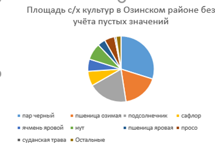

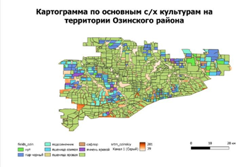

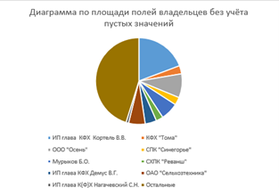

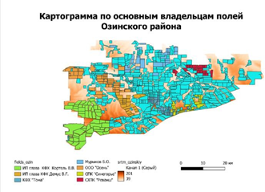

Анализ рельефа показал, что территория относится к равнинному типу.
Высоты лежат в диапазоне от 67 до 221 метра над уровнем моря,
преобладающие уклоны не превышают 7,2 градуса. Основная часть
района имеет уклоны, близкие к нулю, что делает землю пригодной
для сельскохозяйственного использования. Участки с повышенной
крутизной требуют дополнительных мер против эрозии.

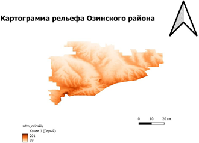

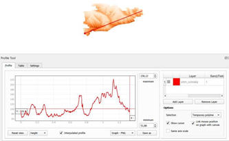

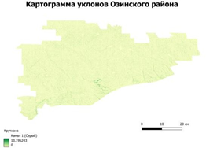

Среднее значение вегетационного индекса NDVI по полям района
составило 0,4984. Это соответствует умеренному уровню растительности
и указывает на наличие достаточной фотосинтетически активной биомассы
на большей части территории. Отдельные участки имеют пониженные
значения индекса, что может быть связано с дефицитом влаги.

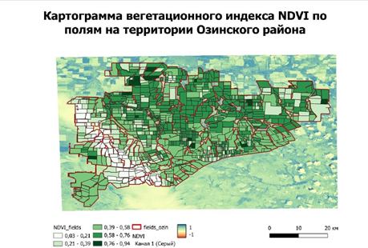

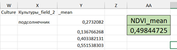

Среднее значение влажностного индекса NDWI составило -0,4858.
Отрицательное значение указывает на низкое содержание воды
в растительности и почвах, что подтверждает засушливость
вегетационного периода. Наибольший дефицит влаги наблюдается
в западной части района.

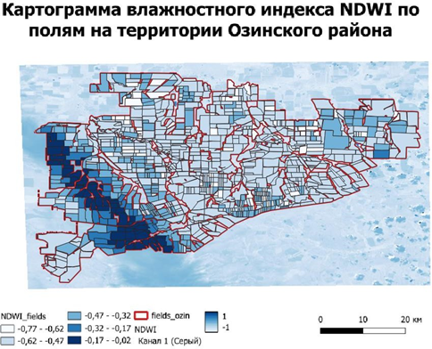

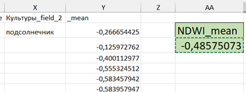

Полученные результаты показывают, что Озинский район обладает
значительным потенциалом для сельскохозяйственного производства,
однако нуждается во внедрении водосберегающих технологий и учёте
рельефа при планировании агротехнических мероприятий.

## Запуск

Установите зависимости:

pip install -r requirements.txt

Скрипты `src/ndvi_ndwi_calculation.py` и `src/relief_analysis.py`
ожидают tif-файлы в папке `data/`. Для расчёта спектральных индексов
необходимы каналы B3, B4 и B5 снимка Landsat 8. Для расчёта уклонов
нужен файл цифровой модели рельефа SRTM. Данные можно скачать
с платформы Earth Explorer по инструкции, приведённой в курсовой
работе. После размещения файлов в папке `data/` запустите:

python src/ndvi_ndwi_calculation.py
python src/relief_analysis.py

Результаты — карты индексов и уклонов — сохранятся в папке `docs/`.

## Стек

Python, numpy, rasterio, matplotlib, QGIS, Earth Explorer.